# Découverte du site web de l'OCDE
## Accéder à une base de données de l'OCDE
Pour accéder au catalogue des bases de données de l'OCDE, cliquez [sur ce lien](https://data.oecd.org/fr/resultatrecherche/). Vous devriez atterir sur la page suivant:
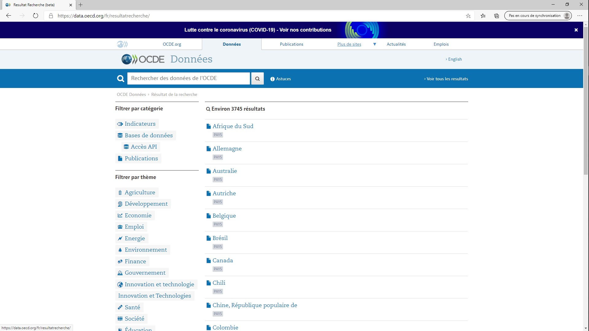

Dans le cadre du TD, nous avons cliqué sur le thème [Développement](https://data.oecd.org/fr/resultatrecherche/?hf=20&b=0&r=%2Bf%2Ftopics_fr%2Fdeveloppement&l=fr&s=score) puis nous avons sélectionné la base [_Egalité homme-femme_](https://www.oecd-ilibrary.org/development/data/statistiques-de-l-ocde-sur-le-developpement-international/egalite-homme-femme-institutions-et-developpement-2014_data-00728-fr). Nous avons atteri sur une page de présentation de la base de données:


Pour afficher la base de donnée en intégralité, nous avons cliqué sur le lien [DONNEES](https://stats.oecd.org/viewhtml.aspx?datasetcode=GIDDB2014&lang=fr) en bas de la page. Nous voilà enfin face à la base femme-homme en plein écran :
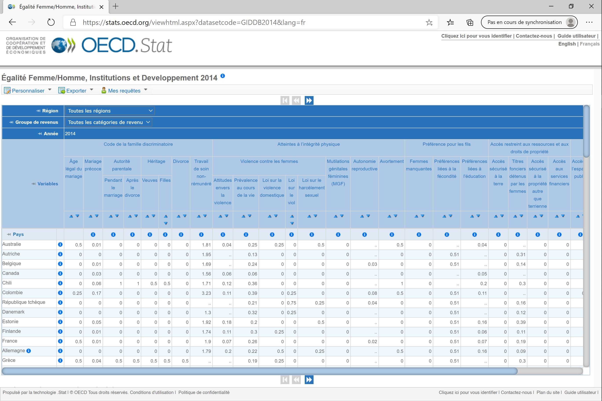

## Sélectionner les variables et les valeurs d'intérêt
Nous sommes maintenant sur le site de la base de données. L'objectif est à présent de sélectionner les données qui nous intéresse. Pour l'exemple on va ici considérer que l'on est intéressé par les données de la France, de la Belgique et de la République Tchèque ainsi que par le groupe de données sur les atteintes à l'intégrité physique.

Ici, on cherche ainsi à la fois à __filtrer__ les _valeurs_ "Belgique", "France" et "République Tchèque" de la _variable_ pays et à __sélectionner__ les _variables_ "Atteintes à l'intégrité physique", "Violence contre les femmes", "Attitude envers la violence", "Prévalence au cours de la vie", "Loi sur la violence domestique", "Loi sur le viol", "Loi sur le harcèlement sexuel", "Mutilations génitales féminines", "Autonomie reproductive" et "Avortement".

Pour sélectionner les variables et les valeurs d'intérêt on clique sur 'Personaliser' (1) en haut à gauche, puis sur 'Sélection' (2) puis finalement sur "Variables" (3).
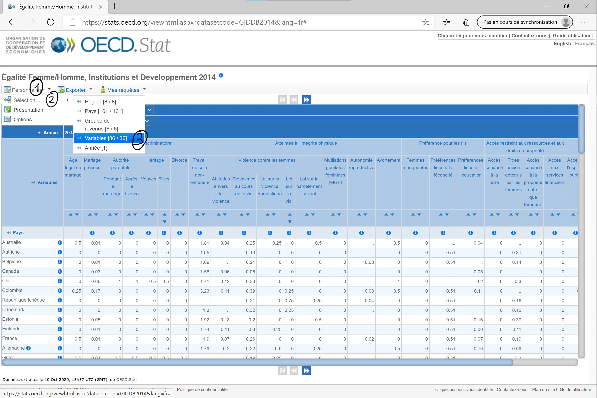

La fenêtre de la 'Sélection des dimensions' s'ouvre. On est dans l'onglet 'Variables' (1). Par défaut, toutes les variables sont sélectionnées. Puisque l'on est intéressé que par une minorité de variables, on clique sur 'Désélectionner tout' (2) puis on clique sur chacune des variables que l'on souhaite garder (3).

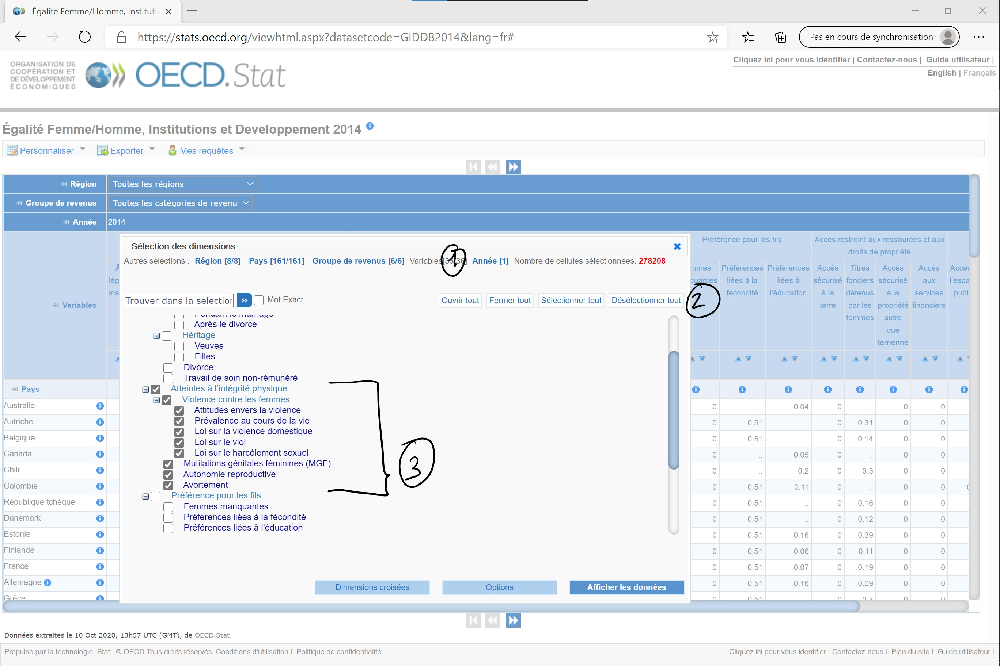

La dernière étape qu'il nous reste à réaliser avant de télécharger la base sur notre ordinateur est de __filtrer__ les pays que l'on souhaite étudier. Sans fermer la fenêtre de 'Sélection des dimensions', on clique sur l'onglet 'Pays' (1) puis l'on sélectionne/désélectionne les pays qui nous intéressent (2). Afin d'afficher la base de donnée contenant les variables et les pays que l'on a choisi, on clique sur 'Afficher les données' (3).

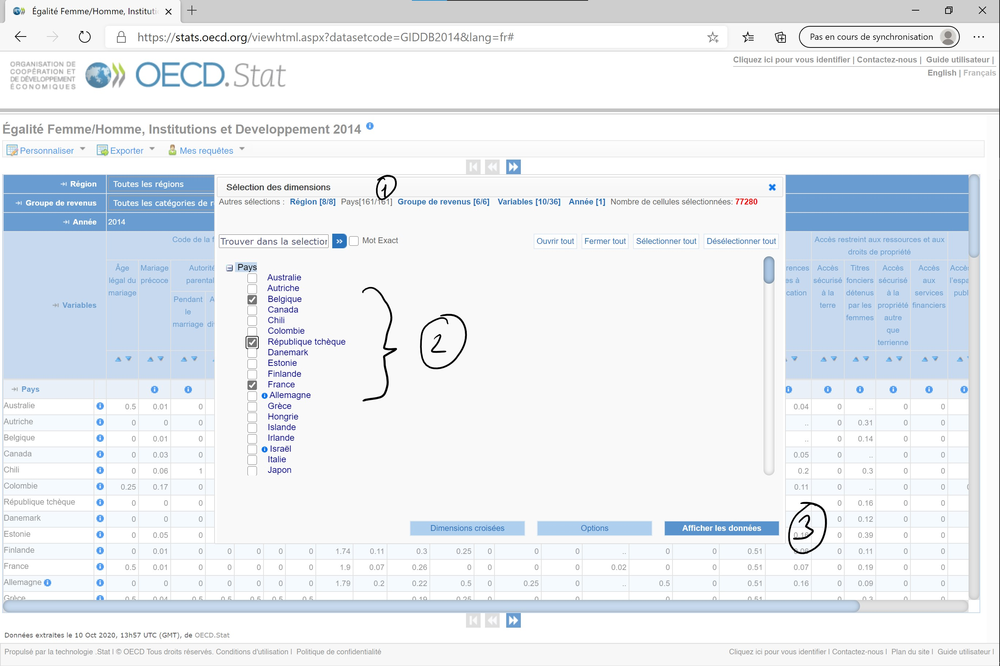

Notre base est prête à être téléchargée.
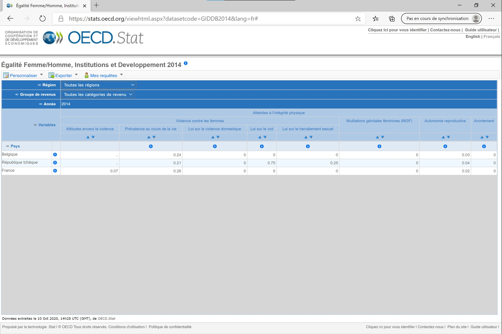


## Télécharger la base sur votre ordinateur
Maintenant que l'on a sélectionné les éléments de la base de données qui nous intéresse, il ne nous reste plus qu'à télécharger cette base et à l'intégrer à R. Procédons à la première étape de ce beau programme.

Pour télécharger cette base de données, on clique sur 'Exporter' (1) puis sur 'Fichier texte (CSV)' (2).
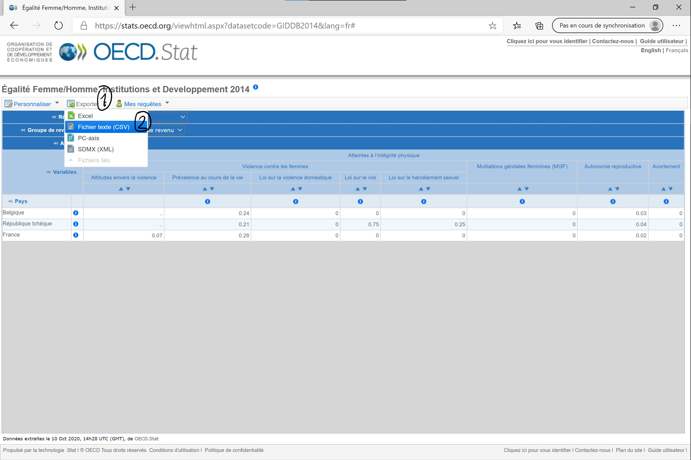

Finalement, on ne change rien au format par défaut (1) et on clique sur 'Téléchargement' (2).

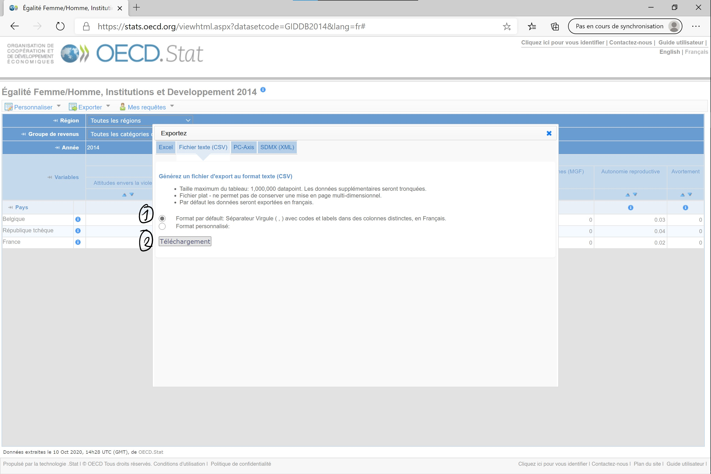

# Organisation des dossiers sur votre ordinateur
Je vous avais promis que la prochaine étape était le chargement de la base de donnée dans R. En fait, il peut d'abord être de bonne augure de prendre le temps d'organiser son projet de recherche sur son ordinateur. Ainsi, je vous conseille vivement de structurer votre dossier contenant vos fichiers scripts, bases de données, graphes, tableaux... 

Un vieux professeur avait un jour conseillé à ma classe d'organiser son dossier comme suit:

* Projet
  + donnees
    + brut
    + propre
  + scripts
  + resultats
  + bibliographie
  
Evidemment, rien ne vous oblige à reprendre cette organisation précise, c'est simplement une suggestion de présentation. Vous ne serez pas notés là dessus. Considérez simplement que mon dossier de TD sera ainsi structuré lorsque je présenterai comment charger une base de données sur R.
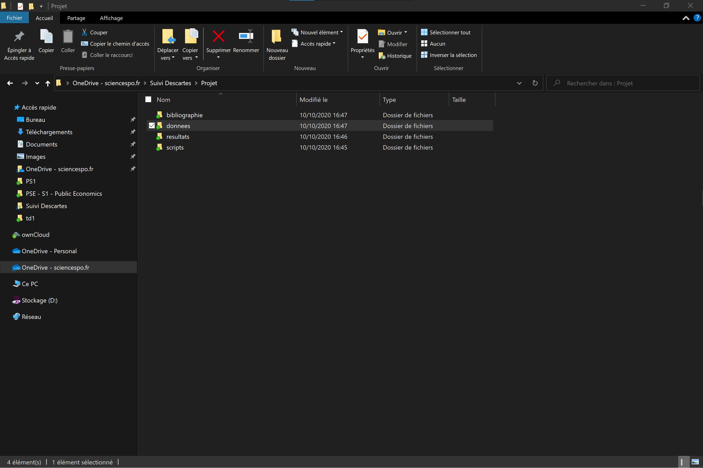

J'ai placé la base de données téléchargée sur le site de l'ocde dans le sous-dossier 'brut' du dossier 'donnees' (1)

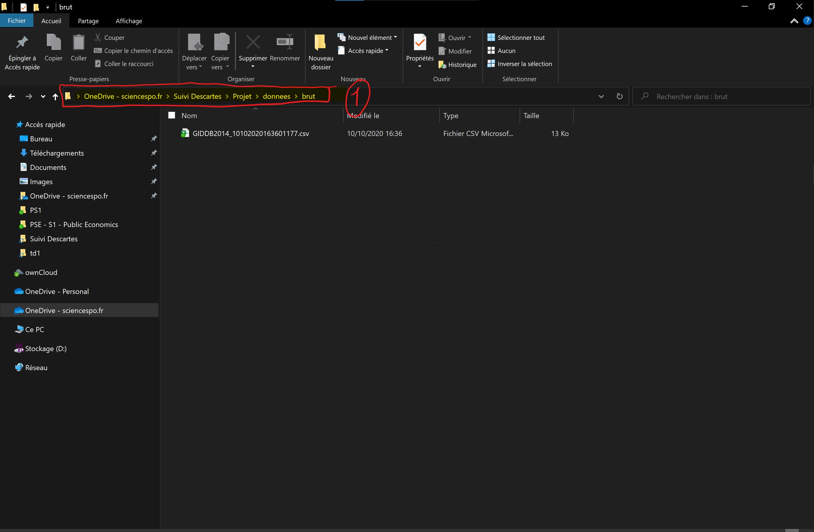
  
# Chargement d'une base dans R
On commence à s'approcher du but, encore un petit effort !

## L'interface de RStudio
Afin de s'assurer que l'on parle tous de la même chose, je vais quand même brièvement vous présenter l'interface de RStudio - que vous avez normalement vu lors de votre TD informatique. 

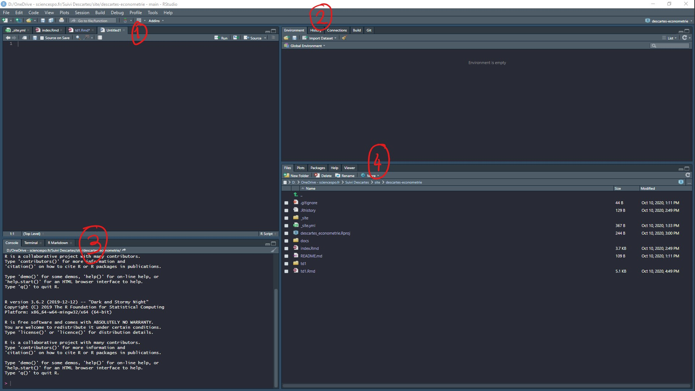
Bienvenue sur RStudio ! Bon, mon interface est probablement d'une autre couleur que la votre car j'ai choisi un thème 'sombre' dans les options du logiciel. Ca fait moins mal aux yeux quand l'on passe un peu de temps dessus. 

Mais ce n'est pas l'important. Ce qu'il faut retenir c'est que votre interface de RStudio est composée de 4 parties qui ont toutes un rôle bien précis :

* Dans la partie (1) vous écrivez vos scripts. Et d'ailleurs peut-être ne voyez vous pas cette partie de l'interface si vous ouvrez RStudio pour la première fois. C'est normal, car vous n'avez pas encore créée votre premier script. Pour ce faire, il vous suffit d'aller dans 'File' et de créer un 'New File' en format 'R Script'. Pour les plus préssé.e.s, il est aussi possible de créer ce script à l'aide du raccourci clavier 'Ctrl + Maj + N'. Chose importante, n'oubliez pas de sauvegarder votre script (dans le sous-dossier 'script' de votre projet) en cliquant sur 'File' puis 'Save' ou bien à l'aide d'un bon vieux 'Ctrl + S'. __Pour les utilisateurs de Mac, il me semble que tous ces raccourcis fonctionnent en remplacant 'Ctrl' par 'Cmd'. Tenez moi au courant.__
* Dans la partie (2) de l'écran vous avez votre 'Environnement'. C'est ici que va se charger la base de données que nous aurons bientôt chargée dans R.
* Dans la partie (3) de votre écran, vous retrouvez la 'Console' de R dans laquelle s'affiche l'ensemble des commandes effectuées ainsi que les résultats de ces commandes.
* Finalement, dans la partie (4) de votre interface, vous pouvez accéder aux graphes que vous créérez dans l'onglet 'Plot', mais également à la liste de tous les Packages téléchargés dans l'onglet 'Packages'. L'onglet 'Help' sert quand à lui à vous donner des informations sur les paramètres des différentes fonctions lorsque vous le demander. Nous verrons dans les prochains TDs comment se servir de ces différentes fenêtres. 


## Le chargement d'une base au format csv
Ok, on passe à présent à l'étape finale, le chargement de la base de donnée dans R. Une fois que l'on a créée son script R et que on l'a enregistré dans le sous-dossier _scripts_ du dossier _Projet_, il faut commencer par dire à R quel est l'emplacement du fichier.

Je crois que je n'ai pas été très clair en cours sur ce point, alors je vais détailler d'avantage la démarche ici et adopter une approche plus transparente. Pour charger le fichier, on va réaliser deux étapes importantes:

1. Définir le dossier ou est le fichier : ce que R appelle le 'working directory'
2. Ouvrir le fichier avec la fonction read.csv

Tout d'abord il faut trouver quel est le chemin d'accès au fichier. 

### Sur Windows

Sur __Windows__ il suffit de se rendre dans ce dossier et de cliquer sur la barre de navigation (1), ensuite on fait un copier coller de ce chemin d'accès dans R. 
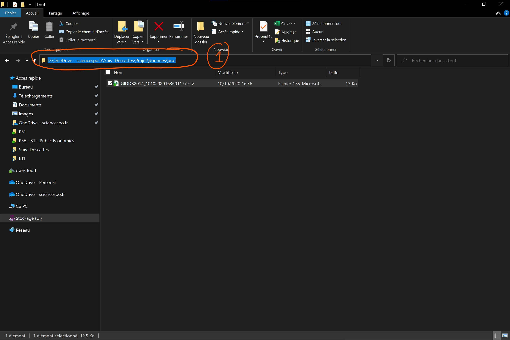
Avec ce chemin d'accès, je crée un _object_ que je dénomme 'chemin'. __Important__ : je place le chemin d'accès au fichier entre guillemets, sinon ça ne marchera pas. Ensuite j'exécute la commande. Pour le faire, soit je sélectionne ma ligne et j'appuie sur 'Run' en haut à droite du script, soit j'utilise le raccourci clavier 'Ctrl + Entrer'.
```{r, eval=F, echo=T}
chemin = "D:\OneDrive - sciencespo.fr\Suivi Descartes\Projet\donnees\brut"

````

Ah ! Une erreur ? En fait R n'aime pas le sens des barres obliques qui sont données par Windows lorsque l'on fait un copier-coller. Pour résoudre ce problème on remplace juste toutes les barres obliques par une barre oblique, mais dans l'autre sens : 

````{r}

chemin = "D:/OneDrive - sciencespo.fr/Suivi Descartes/Projet/donnees/brut"
print(chemin)
````

J'exécute la commande pour créer l'objet. Pas d'erreur, et le chemin est chargé dans mon environnement, parfait !
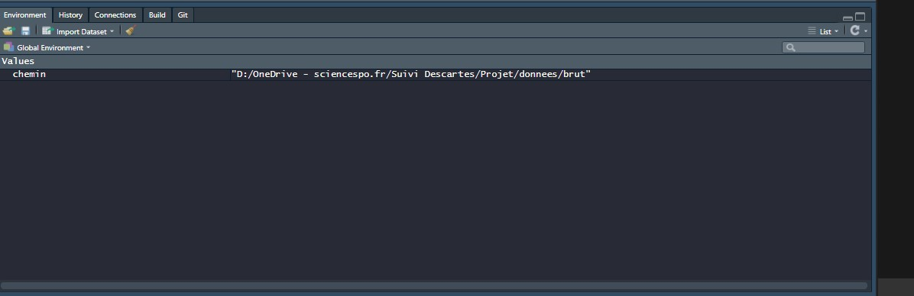
À présent il faut dire à R que l'on va travailler avec les fichiers présents dans ce dossier. On va donc assigner le dossier de travail ('setting the working directory') en utilisant la fonction _setwd()_:
````{r, results='hide'}
setwd(chemin)
````
J'éxecute la commande en cliquant sur 'Run' ou en utilisant le raccourci clavier 'Ctrl + Entrer'. On vérifie dans que tout est à jour:
```{r setup, echo=FALSE}
knitr::opts_knit$set(root.dir = chemin)
```
````{r}
getwd()

````

Succès !

### Sur Mac
Tout d'abord un grand merci à Océane Coudrieu d'avoir pris le temps de trouver une solution pour les utilisateurs de Mac, mais aussi d'avoir pris le temps d'enregistrer la vidéo ci-dessous.

Sur __Mac__ les choses sont en effet un peu différentes que sur Windows. Pour obtenir le chemin d'accès au fichier, il suffit d'ouvrir le Terminal et d'y faire glisser le fichier de la base de données. Le chemin d'accès à l'emplacement du fichier s'affiche. On le copie-colle directement dans le script.


Comme pour windows on crée un _objet_ 'chemin' auquel on assigne la valeur du lien vers l'emplacement au fichier. Attention, n'oubliez pas d'enlever le nom du fichier à la fin du chemin ! Il ne faut pas non plus oublier de mettre le lien entre guillemets. Enfin, pour créer l'objet il faut exécuter la ligne de commande, avec 'Run' en haut à droite du script, ou bien avec 'Cmd + Entrer' :
````{r}

chemin = "/Users/oceanecoudrieu/Documents/L3 SEG/S1/ECONOMETRIE/Recherche/Bases"
print(chemin)
````
(Les plus attentif.ve.s auront remarqué que je n'ai pas gardé les 'é' majuscules dans 'ECONOMETRIE'. Cela est une erreur de ma part qui entraînerait l'impossibilité pour R de charger le fichier puisque le dossier ECONOMETRIE n'existe pas.)

On assigne maintenant le chemin à la fonction 'setwd()' qui nous permet de défnir le dossier dans lequel R doit chercher les bases de données: c'est le 'working directory'
````{r, eval=F, echo=T}
# Je crée l'environnement de travail
setwd(chemin)

# Je vérifie que le working directory est bien à jour
getwd()
````

### Le moment du chargement
Ok, tout est bon, on a défini notre environnement de travail: le working directory. Il ne nous reste plus qu'à charger le fichier dans R. Pour ce faire, on va utiliser la fonction 'read.csv()' dans R.

Les fonctions sont nos plus grandes alliées, car elles nous permettent de faire des trucs vraiments cools, comme par exemple charger une base de données - mais aussi effectuer des modifications sur cette base, ou encore créer des graphes etc... Pour comprendre comment fonctionne une fonction, on peut demander à R de nous l'expliquer :


````{r, eval=F, echo=T}
# Pour demander à R de nous donner des infos sur une fonction
# on exécute ?fonction
?read.csv
````
La fenêtre 'Help' s'ouvre : 
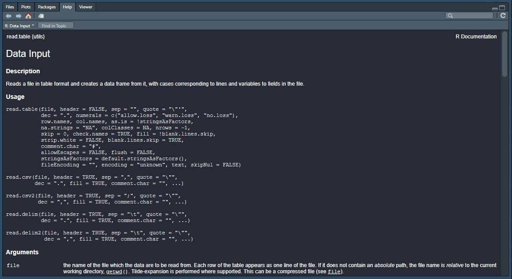
L'aide nous explique que cette fonction lit les fichiers au format 'table' et les transforme en 'dataframe', c'est-à-dire une base de donnée dans le langage de R. On peut voir qu'il existe plusieurs variantes de la fonction en fonction de l'extension du fichier.

Nous sommes intéressés par les paramètres de la fonction read.csv:

* _file_ : Ce paramètre est important pour nous, car c'est grâce à celui-ci que l'on va dire à R où ce situe notre fichier. Comme on a précédemment défini notre 'working directory' (dossier de travail), il ne nous reste plus qu'à signaler à R le nom du fichier à charger.
* _header_ : C'est un paramètre qui prend la valeur 'TRUE' par défaut et qui défini si la première ligne de la base de donnée au format csv contient le nom des colonnes. Comme c'est le cas pour la base que l'on a téléchargé on peut ne pas se soucier de ce paramètre. Si au contraire, la première ligne contenait directement des valeurs observées et pas le nom des colonnes il faudrait spécifier 'header=FALSE'.
* _sep_ : Ce paramètre défini le séprateur entre les colonnes. Si on ouvre la base sur excel, on observe que les colonnes sont séparées par ",". Ca tombe bien, la fenêtre 'Help' nous indique que c'est la valeur que prend le paramètre par défaut. (Souvenez-vous également que c'était l'option par défaut sur le site de l'OCDE lors de l'étape de téléchargement).
* etc...

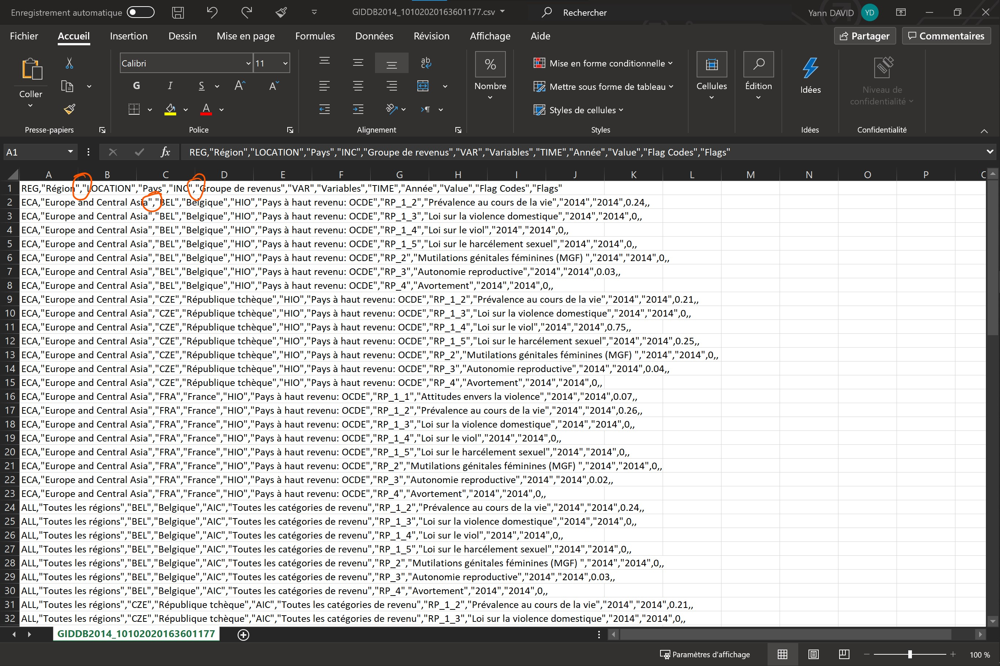

Donc si l'on récapitule, le seul paramètre qu'il nous faut spécifier est le nom du fichier. Je charge la base de donnée dans un object que j'appelle, sans originalité, 'base' :
````{r}
# Chargement d'une base de donnée
base = read.csv(file = 'GIDDB2014_10102020163601177.csv')

# Impression des premières lignes
head(base)
````

La base est chargée dans R !

Vous pouvez essayer de charger la base sans l'assigner à un objet, elle s'ouvrira alors dans votre console mais ne sera pas enregistrée dans l'environnement.

````{r}
# Ouverture de la base sans sa sauvergarde dans l'environnement
read.csv(file = 'GIDDB2014_10102020163601177.csv')
````

Avant de conclure, je dois vous préciser que la création de l'objet 'chemin' n'était pas nécessaire à strictement parler pour charger le fichier. Il aurait été possible de coller l'emplacement du dossier entre guillement directement dans setwd() lors de la définition du 'working directory' : 

````{r, eval=F, echo=T}
# Je crée l'environnement de travail
setwd("D:/OneDrive - sciencespo.fr/Suivi Descartes/Projet/donnees/brut")
````


Pourquoi me compliquer la vie ?

* Pour vous montrer qu'un _objet_ dans R peut contenir différents types d'informations: des valeurs numériques ou des charactères, mais également une base de donnée ou bien un liste.
* Car il est de coutûme d'assigner la valeur des différents paramètres à des objets en dehors de la fonction, afin de rendre la lisibilité des scripts meilleure.

La semaine prochaine, nous verrons ensemble comment (1) manipuler cette base de donnée et (2) en tirer des statistiques descriptives.

Vous pouvez télécharger le script de cette séance [ici](https://drive.google.com/file/d/1RthxcIYQmHvXA1Km_GVcM3rVaACaKbRn/view?usp=sharing) ainsi que la base de données [là](https://drive.google.com/file/d/1kuKMcEGaaqfsOFnn8Mvqgma2BItIQEFE/view?usp=sharing).

À la semaine prochaine. 