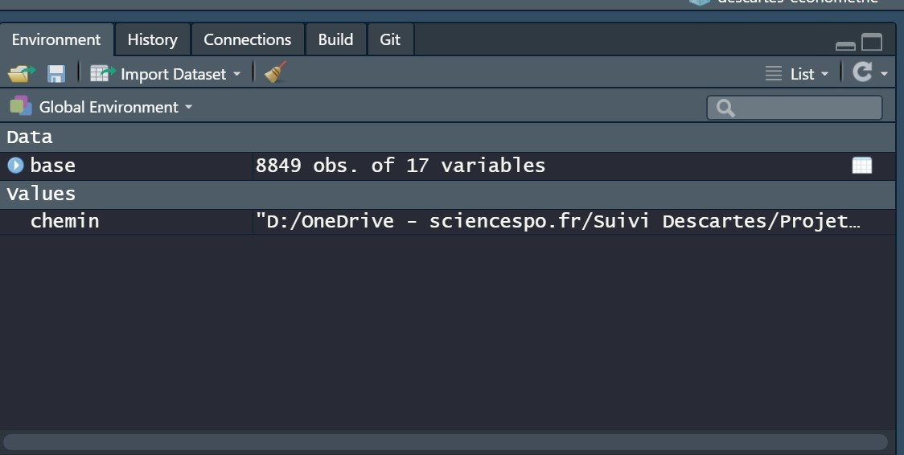
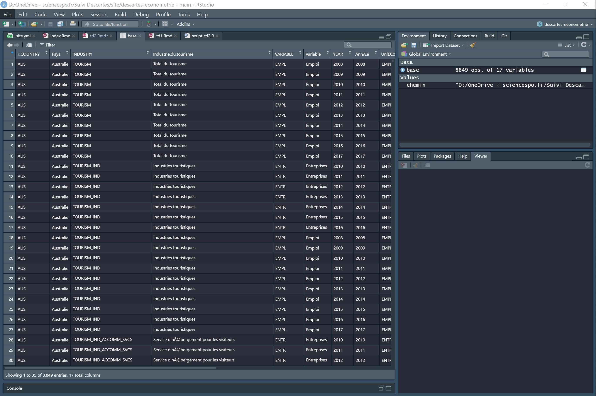

# Chargement de la base Tourisme Emploi
## Téléchargement de la base
Cette semaine, nous allons utiliser une nouvelle base de données Tourisme Emploi [trouvée sur le site de l'OCDE](https://stats.oecd.org/BrandedView.aspx?oecd_bv_id=d2b36bc8-fr&doi=fd945dec-fr). Vous pouvez directement la télécharger dans la version que j'utilise en cliquant sur [le lien ici.](https://drive.google.com/file/d/1jl4PE7LC-pZj5Gac2kYs0E19tzL8RC5i/view?usp=sharing). 

Petite parenthèse. Je vous conseille de chercher les données directement via  [ce site de l'OCDE](https://stats.oecd.org/index.aspx?r=647489) dont l'interface est moins jolie que celui vu la semaine dernière, mais qui est bien plus efficace pour accéder aux données rapidement via le menu de gauche :


Enfin, je vous propose de retrouver le script de cette séance [ici](https://drive.google.com/file/d/1COVtXes910oz2ViOeZHfkC2ns0xfsfnL/view?usp=sharing). Vous pouvez également télécharger directement la base de donnée du jour au format RDS, facilement compréhensible par R, [au lien suivant](https://drive.google.com/file/d/10VIxzKGB0aCNcdJ8wtHvbUEKs_ADeVCz/view?usp=sharing).

## Chargement dans R
Comme la semaine dernière, j'utilise le dossier de projet que j'ai créée. J'ai donc mis la base de données dans mon sous-dossier Projet/donnees/brut. Comme la semaine dernière, j'indique à R que ce sous-dossier est mon 'working directory'.
```{r setup, echo=FALSE}
chemin = "D:/OneDrive - sciencespo.fr/Suivi Descartes/Projet/donnees/brut"
knitr::opts_knit$set(root.dir = chemin)
```

````{r, eval=F, echo=T}

chemin = "D:/OneDrive - sciencespo.fr/Suivi Descartes/Projet/donnees/brut"
setwd(chemin)
````
Je vérifie ensuite qu'il a bien mis à jour le working directory:

````{r}
getwd()

````

Ok on est tout bon, maintenant il ne nous reste plus qu'à charger la nouvelle base de données. Pour ce faire, j'indique simplement à R le nom du fichier dans la fonction read.csv :

````{r}
# Chargement d'une base de donnée
base = read.csv(file = 'TOURISM_ENTR_EMPL_10102020213924949.csv')

# Impression des premières lignes pour vois si tout est bon
head(base)
````

La base est chargée dans R ! On s'était arrêté à ça la semaine dernière, ce qui était un peu frustrant. Dans la prochaine section on va à présent aller plus loin. 

# Première analyse de la base
La base est donc chargée dans notre environnement de travail:

La première chose que l'on a sans doute envie de faire c'est de voir à quoi cette base ressemble. Si l'on écrit dans la console le nom de base et que l'on éxecute la commande, la base de données s'imprime dans la console. Bon c'est un début, mais ce n'est pas très pratique.

````{r, eval=F, echo=T}
base
````
C'est là que R Studio propose une fonctionnalité intéressante : ce logiciel nous offre la possibilité d'ouvrir la base dans une fenêtre séparée. Pour ce faire, deux options:

* On clique sur l'objet base dans la fenêtre _Environment_ en haut à droite du logiciel
* On écrit et on exécute la commande suivante (attention à la majuscule sur le V):
````{r, eval=F, echo=T }
View(base)# Ouvrir la base de donnée:
````
La base s'ouvre dans un nouvel onglet:

Comme vous pouvez le voir, on peut filtrer les informations contenu dans les colonnes et les classer par ordre ascendant on descendant. 

De retour sur notre script R, on peut demander à la console de nous afficher le nom des colonnes de la base:

````{r}
colnames(base)#Noms des colonnes

````
Comme vous pouvez le voir, ces noms de colonne ne sont pas très élégants, nous verrons dans la section suivante comment les modifier pour rendre l'utilisation de la base plus plaisante.

Une commande qui est également utile est la fonction table() qui permet d'avoir accès au décompte des différentes valeurs que prend un variable. Par exemple, pour savoir quels sont les années que couvre la base - information contenu dans la variable YEAR - on écrit:
````{r}
# Informatoions sur le nombre de valeurs par colonne
table(base$YEAR) # années contenues dans la base

````
Dans la console s'imprime la table des résultats. La base contient 767 observations pour l'année 2008 et 419 pour l'année 2018.

Vous avez remarqué un truc bizarre avec le _\$_ ? En effet, pour signaler à R que je ne veux des informations que sur la colonne _YEAR_ de la _base_ il faut que j'utilise le signe dollar entre le nom de la base et le nom de la variable. Cela s'applique dès que j'applique des fonctions à une colonne. 

Ainsi, pour obtenir un tableau du nombre d'observation par indicateur - information contenue dans la variable _VARIABLE_ - j'exécute la commande suivante :

````{r}
table(base$VARIABLE) # indicateurs

````
Ici, R nous délivre l'information suivante : la base contient 4 691 observations sur l'indicateur du nombre d'emplois et 4 158 observations sur l'indicateur du nombre d'entreprises. 

Avant de continuer, je dois vous signaler qu'il est possible d'indiquer à R que vous souhaitez effectuer des opérations sur une colonne de deux façons:

* Avec le signe dollar tel que vous l'avez déjà vu juste avant
* En indiquant le nom de la colonne entre double crochets et entre guillemets
* En indiquant à R le numéro de la colonne entre simple crochets et après une virgule
* En indiquant à R le nom de la colone entre simple crochets et après une virgule

````{r, eval=F, echo=T}
base$VARIABLE
base[["VARIABLE"]]
base[,5]
base[,"VARIABLE"]
````
Pas mal de possibilités, donc, pour aboutir au même résultat. Je vous conseille tout de même d'utiliser le signe dollar, cela rend votre script plus lisible.


Ok, vous avez compris comment la fonction table fonctionne et comment on l'éxecute sur une colonne particulière. On peut aussi l'utiliser pour faire une table croisée du décompte des observations par rapport à deux variables. Ici on cherche à s'avoir combien la base contient d'observation par indicateur par année :
```{r}

table(base$YEAR, base$VARIABLE) # Nombre d'observations par indicateur par année
````

Finalement, on peut regarder quelles valeurs prennent les variables Pays et Industrie.du.tourisme afin de mieux comprendre notre base :
````{r}
table(base$Industrie.du.tourisme)

table(base$Pays)

````

Dans la prochaine section, nous allons voir comment modifier la base de données.

# Modification de la base: _dplyr_
Pour modifier votre base de données, je vais vous présenter un package qui fait la magie de R: _dplyr_. Cette librairie, dont vous pouvez trouver un guide d'utilisation plus que complet [ici](http://larmarange.github.io/analyse-R/manipuler-les-donnees-avec-dplyr.html), vous permet de modifier votre base de donnée à votre convenance tout en rendant lisible vos manipulations à travers une grammaire simple.

## L'installation de dplyr
Première étape, l'installation de la librairie. Pour ce faire, il faut utiliser la commande _install.packages()_ et placer le nom du package d'intérêt entre guillemets entre les parenthèses de la fonction. Vous éxecutez et R s'occupe du reste: il télécharge et intalle la librairie pour vous. 

````{r, eval=F, echo=T}
install.packages("dplyr")

````
Une fois que cela est fait, il faut dire à R que l'on souhaite activer le package  pour pouvoir l'utiliser. Pour cela, on utilise la fonction _library()_ et l'on place le nom du package sans guillemet entre les parenthèses. On exécute. Le package peut à présent être utilisé, ce qui nous permet d'accéder à toutes ses fonctions. 


````{r}
library(dplyr)
````

Avant de commencer les modifications de notre base, j'aimerais souligner l'importance de bien charger vos packages à chaque fois que vous réouvrez R. À l'ouverture, R ne charge que les packages de base du langage. Il faut donc systématiquement lui rappeler de charger les packages qui vous intéressent lorsque vous le redémarrez. Pour ne pas oublier de le faire, je vous conseille de placer vos chargements de package en haut du script systématiquement. 

## Modifications de la base
Nous allons à présent procéder à des modifications de la base. On va tout d'abord modifier le nom d'une colonne, car certaines d'entre elles ont un nom bizarre.

### Modification des noms de colonne
Je me remémore du nom des colonnes en demandant à R de me les imprimer de nouveau :
````{r}
colnames(base)

````
Bon, on va modifier le nom de la première colonne, car la variable "ï..COUNTRY" ne va pas être très pratique à utiliser avec cette dénomination. 

Pour ce faire, je vais utiliser la fonction _rename()_ du package _dplyr_ :
````{r}
# Modification du nom d'une colonne
base_propre <-  base %>% 
  rename("PAYS"="ï..COUNTRY" )
````
Ok, on va décortiquer ce qu'il se passe dans cette ligne étape par étape :

* Premièrement je dénomme _base\_propre_ l'objet dans lequel je vais enregistrer les modifications apportées à la base. 
* Ici j'utilise une flèche " <- " pour dire à R que je vais enregistrer dans _base\_propre_ les modifications apportées à _base_.
* Ensuite j'appelle _base_, l'objet auquel je vais assigner des modifications
* À présent j'appelle la "pipe" %>% qui, dans le langage uniquement compris par dplyr, permet d'assigner à l'objet _base_ une modification à partir d'une fonction de _dplyr_. Le raccourci clavier pour obtenir une pipe rapidement est "Ctrl + Maj + M" sur windows et "Cmd + Shift + M" sur Mac.
* Ca tombe bien, je souhaite appliquer à l'objet _base_ une modification de nom de colonne grâce à une fonction de _dplyr_. Pour ce faire, une fois que j'ai écrit la "pipe", j'écris le nom de la fonction _dplyr_ que je souhaite appliquer à l'objet _base_. Ici j'applique la fonction _rename()_ à la base. La grammaire de la fonction est assez simple : entre guillemets toujours, j'écris le nouveau nom de la colonne d'abord, puis le signe égal, et enfin le nom initial de la colonne. 

Vérifions si tout a bien fonctionné en demandant à R de nous imprimer le nom des colonnes de la _base\_propre_ à laquelle j'ai assigné les modifications:

````{r}
colnames(base_propre)
````
Succès ! 

### Filtrer les données

On va à présent repartir de la _base\_propre_ que l'on vient de créer et ne conserver que les informations pour la France.

Petit rappel d'abord sur le nom exact de la valeur "France" dans la base:
````{r}
# Filtrer la base pour ne garder que les données françaises
table(base$Pays)

````
La commande ci-dessus me permet d'être certains de la manière donc la valeur "France" est écrite dans la base. Si je n'utilise pas cette valeure précise, alors je ne vais pas pouvoir filtrer de donnée.

Pour filtrer les données, on va utiliser la fonction _filter()_ de dplyr. Cette-ci fonctionne à partir de "tests". C'est-à-dire qu'on lui demande de vérifier une condition et la fonction ne conservera à la fin que les valeurs pour laquelle cette condition est remplie. Par exemple pour ne conserver que les données pour lesquels la variable Pays prend la valeur "France" on écrit:
````{r}
base_france <- base_propre %>% 
  filter(Pays == "France")

````
Petit zoom sur ce qu'il se passe ici:

* On remarque la même structure de commande qu'avec _rename_ pour assigner une fonction _dplyr_ à un objet. La seule chose qui change c'est le nom des objets et le nom de la fonction qu'on applique, ici _filter()_, mais la flèche d'assignation et la "pipe" sont toujours présentes. 
* La fonction _filter()_ fonctionne avec des conditions. Elle ne conserve les observations que pour lesquelles la condition vaut TRUE.
* Il est possible d'appliquer d'autres arguments pour votre test, je vous laisse consulter la ressource [ici](https://juba.github.io/tidyverse/10-dplyr.html) pour plus d'information. 

On vérifie si notre filtre a bien été appliqué en regardant quelles valeurs prend la variable Pays de la base _base\_france_ que l'on vient de créer:
````{r}

table(base_france$Pays)
````

De la même manière, je filtre les données de la base que je vient de créer pour ne conserver que les données concernant l'emploi (j'enlève les données qui concernent le nombre d'entreprises) : 
````{r}
# Filtrer la base pour ne garder que les donn?es d'emploi
table(base$VARIABLE)

base_france <- base_france %>% # Je pars de la base que j'ai créée précédement
  filter(VARIABLE == "EMPL")

````


### Sélectionner certaines colonnes
Je vous propose de découvrir à présent un type d'opération qui est important. La fonction _select()_ de _dplyr_ vous permet de sélectionner les colonnes que vous souhaitez conserver.

Première étape, je me remémore le nom des colonnes de ma base :
````{r}
# Sélectionner seulement certaines variables/colonnes
colnames(base_france)
````
Je ne souhaite conserver que les colonnes "INDUSTRY", "Industrie.du.tourisme", "YEAR" et "Value". Pour ce faire, j'utilise la fonction _select()_ :
````{r}
base_france <- base_france %>% 
  select(INDUSTRY, `Industrie.du.tourisme`, YEAR, Value)
````

Comme pour les deux fonctions présentées ci-dessus, la flèche et la "pipe" sont de la partie. Dans la fonction select() j'écris simplement le nom des colonnes. 

````{r}
colnames(base_france)


````

### Créer ou modifier une colonne
Finalement, une fonction assez pratique de _dplyr_ vous permet de modifier ou de créer une colonne. Il s'agit de la fonction _mutate()_.

Admettons par exemple que je souhaite créer des colonnes qui ne prennent les valeurs maximum, minimum et moyenne d'emploi, alors j'écris:

````{r, eval=F, echo=T}
base_france <- base_france %>%
  mutate(mean_emploi = mean(Value, na.rm=T),
         max_emploi = max(Value, na.rm=T),
         min_emploi = min(Value, na.rm=T))
````

Dans la même idée, je peux créer une variable qui prendra pour valeur la moyenne du nombre d'emploi moyens par année. Pour se faire, je vais ajouter une ligne de commande avant d'éxecuter _mutate()_ et je vais indiquer à R qu'il doit grouper ses modifications par rapport à la variable "YEAR". Cette fonction de groupement s'appelle _group\_by()_ :

````{r, eval=F, echo=T}
base_france <- base_france %>% 
  group_by(YEAR)
  mutate(mean_emploi_annee = mean(`Value`, na.rm=T))
````

Pour utiliser _group\_by()_ j'indique simplement entre les parenthèses le nom de la ou des variables de groupement.

Voici quelques bases d'utilisation de dplyr. Je vous invite fortement à en apprendre d'avantage de votre côté, et notamment en utilisant cette [excellente ressource](http://larmarange.github.io/analyse-R/manipuler-les-donnees-avec-dplyr.html),.

# Analyses statistiques des données
Ok, on a modifié notre base de donnée afin de créer une plus petit base de données avec uniquement des informations sur l'emploi touristique en France.

Nous allons à présent voir brièvement comment obtenir des statistiques descriptives de ces données d'emploi. Nous avons déjà vu les fonctions _mean()_, _max()_ et _min()_ dans la section précédente. Nous pouvons les réutiliser hors de la fonction mutate pour obtenir des données sur un colonne : 
````{r}
mean(base_france$Value) 
min(base_france$Value)
max(base_france$Value)

````
Une manière plus rapide d'obtenir cette information est d'utiliser la fonction _summary()_ :

````{r}
summary(base_france$Value)
````

Si vous souhaitez obtenir la variance ou l'écart-type, des fonctions existent également:

````{r}
sd(base_france$Value)
var(base_france$Value)
````
Notez au passage que vous pouvez tester l'égalité entre deux valeurs:

````{r}
sd(base_france$Value)^2 == var(base_france$Value)
sd(base_france$Value) == sqrt(var(base_france$Value))
````

On peut également être intéressé de n'obtenir ces informations que pour une branche particulière du tourisme. Dans ce cas, on peut soit filtrer la base en utilisant la fonction _filter()_ du packages _dplyr_ tel que nous l'avons vu précédement, soit en utilisant une fonctionnalité intégrée à R. Je m'explique. Comme avec _filter()_ on va utiliser les conditions pour filtrer un sous-ensemble de la base. Je regarde d'abord quels sont les valeurs possibles pour les branches de l'industrie du tourisme:
````{r}
table(base_france$Industrie.du.tourisme)

````
Je vais m'intéresser aux chiffres du Total du tourisme. Pour obtenir la moyenne du nombre d'emplois, j'exécute:
````{r}
mean(base_france$Value[base_france$Industrie.du.tourisme=='Total du tourisme'])
````
Que se passe-t-il dans cette ligne ?

* Tout d'abord on reconnaît la fonction _mean()_ et jusqu'à "base_france\$Value" tout est normal.
* Seulement ensuite, j'ajoute entre crochets une condition. Cette condition va définir le sous-ensemble de valeurs sur lesquels je souhaite que R applique la fonction _mean()_

De la même façon, on peut obtenir :
````{r}
sd(base_france$Value[base_france$Industrie.du.tourisme=='Total du tourisme'])
max(base_france$Value[base_france$Industrie.du.tourisme=='Total du tourisme'])
min(base_france$Value[base_france$Industrie.du.tourisme=='Total du tourisme'])
````

Et si l'on veut l'ensemble de ces informations d'un coup, alors la fonction _summary()_ fait son grand retour :
````{r}

summary(base_france$Value[base_france$Industrie.du.tourisme=='Total du tourisme'])
````

Si à présent je souhaite connaître l'année pour laquelle le nombre d'employés totaux du tourisme a été le minimum, comment faire ?

La condition que l'on va tester est la suivante : la valeur d'emploi doit être le minimum sur tout la série. Cette valeur minimale on peut l'enregistrer dans un premier objet :
````{r}
val_min = min(base_france$Value[base_france$Industrie.du.tourisme=='Total du tourisme'])
````
Ensuite on veut l'année qui correspond à cette valeur, alors on va simplement sélectionner le sous-ensemble d'année(s) pour laquelle ou lesquelles le nombre d'employés totaux du tourisme prend cette valeur minimale.

On exécute la commande suivante :
```{r}
year_min = base_france$YEAR[base_france$Value ==val_min ] 
print(year_min)
````
On peut procéder de la même manière, en une ligne, pour obtenir l'année qui a connu le plus grand nombre d'employés du tourisme : 
````{r}
year_max = base_france$YEAR[base_france$Value == max(base_france$Value[base_france$Industrie.du.tourisme=='Total du tourisme'])]
print(year_max)
````

Vous avez maintenant tous les outils pour analyser votre base de données. Tous les outils, ou presque, car parfois, un graph vaut mieux que mille mesures dans un tableau pour la compréhension de vos lecteurs. Dans la prochaine section j'ai donc le plaisir de vous présenter le fonctionnement des graphs sur R.

# Analyses graphiques des données: _ggplot_
C'est la dernière étape de notre TD du jour. La partie la plus intéressante, car vous pourrez à la fin obtenir de beaux graphs colorés qui rendront vos rapports plus agréables à lire.

Accrochez vous pour cette dernière ligne droite car les choses se compliquent légèrement.

## Les graphs basiques sur R
La première étape de cette présentation des graphs et de vous montrer la fonction basique intégrée à R vous permettant d'en faire. Ici, je vais réaliser un graphique de points dont les répères sont l'année en abcisse (x) et le nombre d'emplois en ordonnée (y).
````{r}

plot(x = base_france$YEAR[base_france$Industrie.du.tourisme=='Total du tourisme'],
     y = base_france$Value[base_france$Industrie.du.tourisme=='Total du tourisme'],
     xlab='Année', ylab='Emplois', main="Evolution du nombre d'emplois totaux dans le tourisme",
     sub='2008-2018')

````
   

Comme vous pouvez le lire, cette fonction me permet de choisir :

* La valeur de x, la valeur de y
* La légende de x et de y
* Le titre du graph
* Le sous-titre du graph

Pour plus d'options vous pouvez utiliser le classique :
````{r, eval=F, echo=T}
?plot
````
D'autres fonctions basiques existent comme _hist()_ ou _barplot()_, qui reprennent le même type de fonctionnement que _plot()_.

## Les graphs ggplot
J'aimerais maintenant vous présenter un des joyaux de la famille des packages de R. La librairie _ggplot2_. Elle vous permettra de personnaliser vos graphs presque à l'infini, et ce de manière relativement facile. L'excellente [ressource écrite par Julien Barnier](https://juba.github.io/tidyverse/08-ggplot2.html) vous offrira un tour d'horizon plus que complet de ces possibilités, que je ne pourrai égaler dans cette courte introduction.

Nous allons donc commencer par installer la librairie et intialiser le package :
````{r, eval=F, echo=T}
install.packages("ggplot2")
````
````{r}
library(ggplot2)
````

Nous somme à présent prêts pour réaliser notre premier graph. Pour refaire le graph que nous avons réalisé juste avant en utilisant _plot()_, il nous faut les lignes suivantes :
````{r}
ggplot(data = base_france[base_france$Industrie.du.tourisme=='Total du tourisme',],
       aes(x=factor(YEAR), y =Value))+
  geom_point() +
  labs(x='Année',
       y='Emplois',
       title = "Nombre d'emplois totaux dans le tourisme (2008-2019)")

````

  

Décortiquons à présent ce code:

* Dans la première ligne nous créons un objet _ggplot_. Nous déclarons à la fonction que la donnée utilisée provient de la base _base\_france_, et encore une fois nous n'en utilisons qu'un sous-échantillon. 
* La deuxième ligne définit l'_aes()_. Cette sous-fonction de ggplot est en fait l'endroit dans lequel vous allez définir la valeur que prendra x et que prendra y. Ici, vous remarquez que j'ai demandé à la fonction de considérer la variable YEAR comme un facteur, cela permet simplement que ces valeurs soient considérées comme discrètes par ggplot. Essayer d'écrire x=YEAR tout simplement et de ré-exécuter la commande, vous comprendrez la différence.
* Ensuite, on ajoute à notre objet ggplot de base un _geom_ qui dans ce cas sera _geom\_point_. C'est en fait une fonction comprise par ggplot et qui dans ce cas précis lui indique qu'il doit afficher les valeurs sous forme de point.
* Finalement j'ajoute à ce graph les labels que je définis dans la sous-fonction _labs()_
* Vous remarquerez qu'ici les fonctions s'additionnent avec un "+". 

Bon jusqu'ici vous ne devez pas nécessairement trouver que ce package soit plus intéressant que la fonction basique intégrée à R. Laissez-moi vous montrer comment il est facile d'ajouter une ligne qui reliera les différents points que vous voyez tracés à l'écran. Il vous suffit d'ajouter _geom\_line()_ à votre code.
````{r}
ggplot(data = base_france[base_france$Industrie.du.tourisme=='Total du tourisme',],
       aes(x=factor(YEAR), y =Value))+
  geom_point() +
  geom_line(group=1) +
  labs(x='Année',
       y='Emplois',
       title = "Nombre d'emplois totaux dans le tourisme (2008-2019)")
````

  

Vous pouvez également personnaliser le thème de votre gaph, afin notamment d'enlever ce fond gris un peu ideux en ajoutant _theme\_classic()_ à votre graph par exemple:
````{r}

ggplot(data = base_france[base_france$Industrie.du.tourisme=='Total du tourisme',],
       aes(x=factor(YEAR), y =Value))+
  geom_point() +
  geom_line(group=1) +
  labs(x='Année',
       y='Emplois',
       title = "Nombre d'emplois totaux dans le tourisme (2008-2019)")+
  theme_classic()
````


  
Pour finir cette séance, voici un autre type de graph que l'on peut réaliser avec ggplot. À présent, je vais créer un graph à barres, dont la taille de la barre équivaut au nombre d'emplois totaux par année. De plus, je vais utiliser le paramètre _fill_ dans la sous fonction _aes_ de la fonction _ggplot_ pour faire en sorte que chaque barre soit divisée en sous-régions dont la taille sera proportionnelle au nombres d'emplois par branche.

Première étape, je modifie la base de donnée pour enlever toutes les catégories qui représentent des aggrégats des différentes branches:
````{r}
base_france2 <- base_france %>% 
  filter(INDUSTRY != "TOURISM",
         INDUSTRY!='TOURISM_IND',
         INDUSTRY !='TOURISM_IND_TRANSPORT',
         INDUSTRY != 'TOURISM_IND_ACCOMM_SVCS_HOTELS')

````
Je réalise à présent un premier graph en utilisant _geom\_col()_. Ce premier graph présente le nombre total d'emplois du tourisme par année.
````{r}
ggplot(base_france2,
       aes(x=factor(YEAR),
           y=Value,
           group=factor(YEAR)))+
  geom_col()
````
  
  

À présent, je vais vous montrer comment en assignant au paramètre _fill_ de l'_aes()_ le nom de la variable des différentes branches, j'obtiens une découpe de chaque barre en sous-région dont la hauteur est proportionnelle au nombres d'employés concernés :
````{r}

ggplot(base_france2,
       aes(x=factor(YEAR),
           y=Value,
           group=factor(YEAR),
           fill=INDUSTRY))+
  geom_col()

````


Voilà pour la présentation des différentes fonctions aujourd'hui.

Vous avez à présent toutes les bases pour commencer l'analyse de votre base de données. N'hésitez pas à m'intérroger et à me demander d'avantages de précisions si des doutes subsistent.

