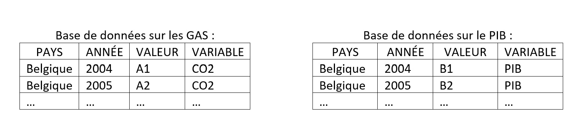
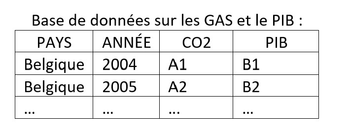
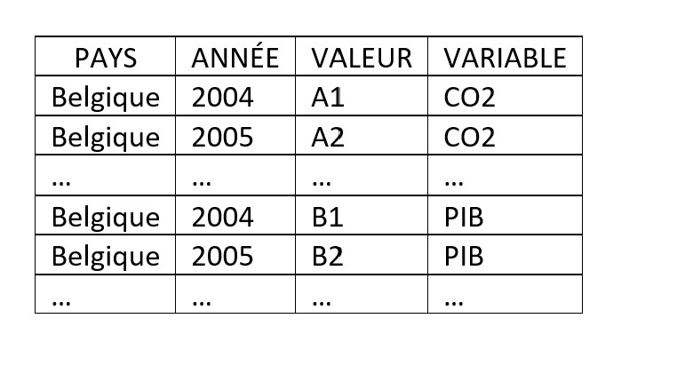
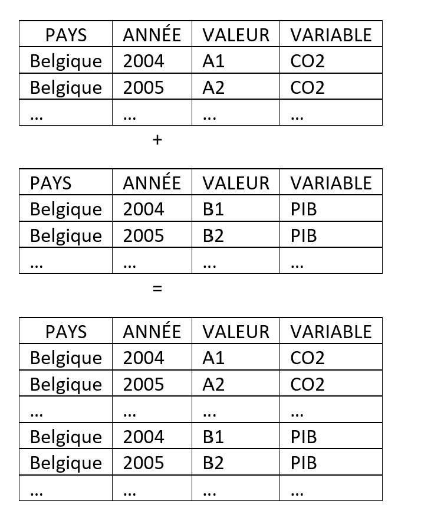
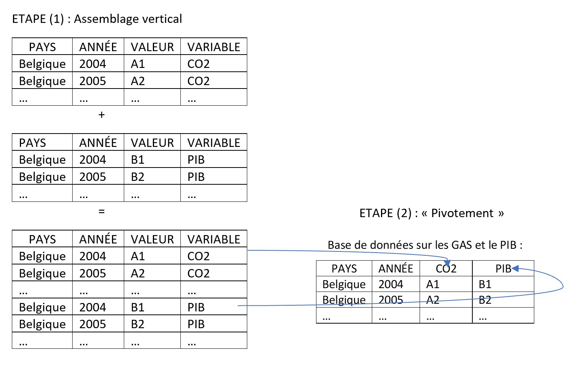
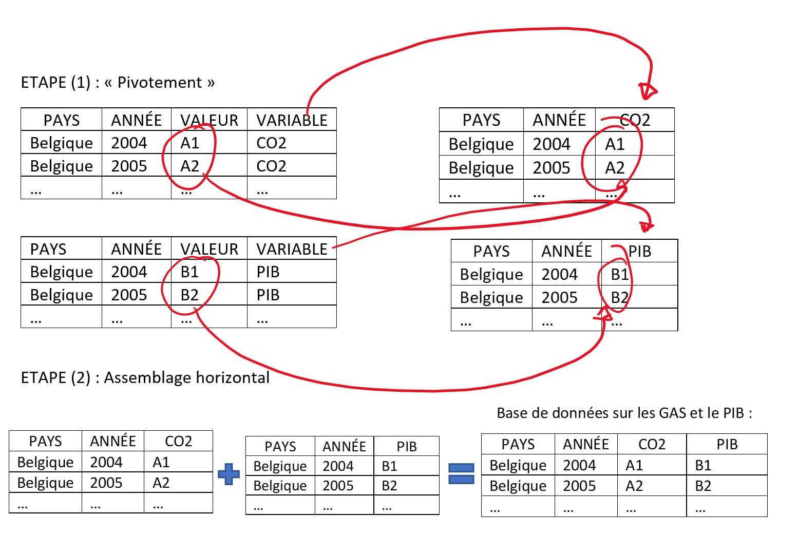

Cette semaine, nous allons voir comment assembler les différentes bases de donnée que vous avez collecté jusqu'à présent. L'objectif est d'obtenir une table de donnée qui vous permettre de réaliser vos régressions.

(Edit 06/11 : Vous pouvez retrouver le script de ce que nous avons fait durant la séance 4 au [lien suivant](https://drive.google.com/file/d/1Xrw_gRVCN9D5Cc8z2CgdhehQJS4rqM0N/view?usp=sharing).)

## Une base de donnée pour réaliser une régression
### La forme de la base de donnée que l'on souhaite obtenir
Admettons que nous souhaitons comprendre quels sont les déterminants de la quantité d'émissions de gaz à effet de serre. Pour réaliser cette analyse on peut faire l'hypothèse que différents facteurs vont entraîner ces émissions :

* Le nombre d'habitants
* La valeur produite par l'économie: le PIB
* Le nombre de voitures

Pour simplifier les explications, nous allons commencer par réaliser une analyse bivariée. Cela veut dire que nous allons considérer uniquement la relation entre la pollution et le PIB.

On va donc chercher ces données sur le site de l'OCDE pour les assembler. On va se retrouver avec deux bases de données qui ressembleront à ceci:


Notre objectif va être de transformer ces deux bases et de les assembler pour obtenir une base finale au format suivant:




Que remarque-t-on ?

* Tout d'abord qu'il existe deux types de variable. Les variables __identifiant__ qui définissent l'unité d'observation. Ici, nous avons une observation par pays-année. Les deux variables d'identifiant sont donc _PAYS_ et _ANNÉE_. Le deuxième type de variable et ce que nous pouvons appeler les facteurs du modèle. Ici, ces variables sont le _CO2_ et le _PIB_. Les variables __identifiant__ nous servent donc de référence pour assembler les informations contenues dans les variables __facteurs__ du modèle.
* Nous observons aussi que nous avons combiné en une seule colonne ce qui était autrefois combiné dans deux colonnes dans les bases de donnée initiales. C'est-à-dire que nous avons crée une colonne par facteur du modèle, alors que dans les bases de données initiales il y avait une colonne pour la valeur et une colonne pour le nom du facteur.

Cette dernière remarque m'amène à vous présenter une autre manière dont nous aurions pu assembler les deux bases de donnée initiales: 


Il est important de noter que cet autre format de base de données contient exactement les mêmes informations que l'assemblage des deux bases de donnée présenté précédemment. La différence est que dans ce dernier cas, nous conservons le format original des deux bases de données. Nous réalisons dès lors un assemblage vertical des deux bases de données. Cela nous donne une base de donnée au format "Long":


Il est très facile de réaliser cet assemblage vertical de deux bases de données puisqu'il ne s'agit que de les superposer. Seul soucis: ce format n'est pas adapté aux régressions comme expliqué plus haut. Nous avons en effet besoin d'un assemblage horizontal des bases de données initiale afin d'obtenir une base de données finale au format "Large".

Mais alors comment l'obtenir ? Deux possibilités !

La première : on part de la base de donnée au format "Long" que l'on a obtenu en réalisant un assemblage vertical, et il s'agit de faire "pivoter" la base pour que celle-ci contienne par _PAYS_ et _ANNEE_ une observation pour chacun des facteurs qui nous intéresse. On utilisera la fonction _pivot\_wider()_ dans R.



La deuxième possibilité est de réaliser d'abord le pivotement sur chaque base de donnée initiale et de réaliser ensuite un assemblage horizontal de ces bases de données. Pour réaliser cet assemblage on utilisera alors la famille de fonction _all\_join()_, _left\_join()_ et _inner\_join()_ en fonction du type d'assemblage que l'on souhaite réaliser. Mais je reviendrai sur ce point au moment venu.



Voilà pour la théorie. Passons à la pratique à partir de deux bases de données que nous avons déjà utilisées lors des deux premiers TDs.

### Place à la pratique: initialisation du script
Pour rappel, les bases de données que nous avions utilisées étaient des bases de données sur les violences sexistes et sexuelles (TD1) et sur l'emploi dans le tourisme (TD2).

Avant de commencer la pratique, nous allons d'abord lancer les packages dont nous allons avoir besoin et définir le chemin d'accès au dossier contenant les deux bases de données dont nous avons besoin. Nous allons également charge les deux bases de données. C'est une bonne pratique de commencer vos scripts en réalisant ces trois étapes - elles sont la clé de la réplicabilité de vos résultats.

Les liens d'accès aux deux bases de données sont : [celui-ci](https://drive.google.com/file/d/1_aNiyTrLlpJ3S7mpXw8Q2CP_U2vVEyu_/view?usp=sharing) et [ceui-là](https://drive.google.com/file/d/1F-sFfkrEYsyHIE9KTXQc66kxqokpdrPI/view?usp=sharing). 

Comme les semaines précédentes, je charge les données dans R après avoir indiqué le chemin d'accès au dossier. 
```{r setup, echo=FALSE}
chemin = "D:/OneDrive - sciencespo.fr/Suivi Descartes/Projet/donnees/brut"
knitr::opts_knit$set(root.dir = chemin)
```

````{r, eval=F, echo=T}
chemin = "D:/OneDrive - sciencespo.fr/Suivi Descartes/Projet/donnees/brut"
setwd(chemin)
````

````{r}
emploi = readRDS(file = 'emploi.RDS')
violence = readRDS(file = 'violences.RDS')
````

J'initialise également le package _tidyverse_ que je vais utiliser. 

````{r}
# install.packages('tidyverse')
library(tidyverse)
````
### Méthode 1 : Assemblage vertical puis pivotement
Pour cette première méthode d'assemblage vertical, il nous faut d'abord nous assurer que les bases de données contiennent bien la même structure de variables : le même nombre de colonnes et les mêmes noms de colonnes. On procède tout d'abord à un nettoyage des bases de données.
#### Etape 1 : Nettoyage des bases de données
Après avoir regardé les différents noms de colonnes, je décide de ne conserver que les colonnes:

* "Pays", (variable _identifiant_)
* "ï..COUNTRY", (variable _identifiant_)
* "Variable", (variable _facteur_)
* "YEAR", (variable _identifiant_)
* et "Value" (variable _facteur_)

Par mesure de précaution, j'assigne les modifications de la base dans un objet que j'appelle _emploi_net_. Ainsi, si j'effectue une modification qui ne me plaît pas, je peux revenir dessus en modifiant différement la base originale à laquelle je ne touche pas. 
````{r}
colnames(emploi)
emploi_net =  emploi %>% 
  select("Pays","ï..COUNTRY",
         "Variable","YEAR","Value"
         )

````
La prochaine étape consiste à modifier les noms des variables pour une raison purement cosmétique mais également pour s'assurer que les colonnes des deux bases de données que l'on va assembler auront bien les mêmes noms. Ici, je ne renomme que les variables "ï..COUNTRY" et "Variable" grâce à la fonction _rename_ que je vous ai présenté lors du [TD2](https://yanndav.github.io/descartes-econometrie/td2.html#Modification_des_noms_de_colonne).

````{r}
emploi_net =  emploi %>% 
  select("Pays","ï..COUNTRY",
         "Variable","YEAR","Value")%>%
  rename("LOCATION"="ï..COUNTRY",
         "Variables"="Variable")

````
Comme vous pouvez le remarquer, j'ai inséré toutes les étapes à la suite - grâce à la magie de la pipe de _dplyr_. Cela signifie donc que le code ci-dessus inclut l'étape de sélection des colonnes que je vous avais présenté juste avant. Il n'est donc pas nécessaire d'intégrer les deux bouts de code dans votre script, mais uniquement ce dernier bout de code. Je vous laisse essayer.


À présent, j'effectue le même travail de sélection de données et de changement de nom sur la deuxième base de données:
````{r}
colnames(violence)
violence_net = violence %>% 
  select( "LOCATION","Pays",
          "Value","Variables","TIME") %>% 
  rename("YEAR"="TIME") 
````

Nous avons à présent deux bases de données qui ont les mêmes noms de colonne. L'ordre n'est pas le même, mais R ne s'en souciera pas lors de l'assemblage.
````{r}
colnames(violence_net)
colnames(emploi_net)
````

#### Etape 2 : Assemblage vertical des bases de données
Génial ! Si l'on se rappelle ce qui était expliqué plus haut, cela signifie qu'il faut à présent procéder à l'assemblage vertical. Pour ce faire on utilise la fonction _rbind_ qui est le diminutif de "row bind", c'est à dire "assemblage par les lignes". 
````{r}
base_verticale = rbind(emploi_net, 
                       violence_net)
head(base_verticale)
````
Notre base verticale est créée ! La dernière étape va être de faire pivoter la base afin d'obtenir un base au format "large".

#### Etape 3 : Le pivotement de la base
Pour faire pivoter la base de données, nous allons utiliser la fonction _pivot\_wider_ qui provient du package _dplyr_ qui est lui même chargé lorsque l'on charge _tidyverse_. Cette fonction, _pivot\_wider_ peut prendre plusieurs paramètres qui vont lui expliquer quelles variables elle doit faire pivoter et autour de quel axe. Nous allons n'avoir besoin que de quelques paramètres :

* _id\_cols_ : ce paramètre défini l'axe de pivot ! Et notre axe de pivot n'est rien d'autre que nos variables _identifiant_ puisque ce qui nous intéresse c'est d'avoir une observation par Pays par année pour chacune des variables _facteur_ de notre base. Comme nos variables pivots sont plusieurs, il faut les indiquer à R dans un vecteur. C'est pourquoi nous les insérons dans le vecteur "c(...)"
* _names\_from_ : ce paramètre va définir le nom des différentes colonnes _facteur_. Dans la structuration de notre base, tous les noms de facteurs sont définis dans la colonne "Variables".
* _values\_from_ : ce dernier paramètre désigne à R la colonne dont il va devoir extraire les valeurs qu'il assignera aux différents _facteurs_ pour chaque pays et année.

````{r}

base_large = base_verticale %>% 
  pivot_wider(id_cols = c("Pays","LOCATION","YEAR" ),
              names_from = "Variables", 
              values_from = "Value")

````
On vient d'exécuter le script, et là... "patatra" : ERREUR. R nous indique que les valeurs dans la colonne 'Value' ne sont pas uniquement identifiées. Cela signifie que pour chaque pays, pour chaque année, nous avons plusieurs valeurs possibles pour certains facteurs que nous voulons étudier. 

En effet, je suis allé un peu vite en besogne pour vous montrer les différentes étapes clés et ne pas alourdir mes explications, mais il va falloir que nous revenions à présent sensiblement en arrière. 

Dans la base de données sur le tourisme, j'ai sélectionné les colonnes qui m'intéressait en omettant l'existence d'une variable très importante qui définit à quelle sous-branche du secteur touristique les données se rattachent. C'est la colonne "Industrie.du.tourisme".
`````{r}
colnames(emploi)
````
Par conséquent, puisque j'ai supprimé cette information, R découvre lorsque j'essaie de faire pivoter la base que pour chaque pays chaque année, j'ai plusieurs informations disponibles concernant l'emploi touristique ou le nombre d'entreprises. Dans le cadre de cet exemple, la solution va consister à ne sélectionner que la branche de l'industrie touristique qui nous intéresse. ici, le "Total du tourisme" :

````{r}
  emploi_net =  emploi %>% 
  filter(Industrie.du.tourisme=="Total du tourisme")%>% 
  select("Pays","ï..COUNTRY",
         "Variable","YEAR","Value")%>%
  rename("LOCATION"="ï..COUNTRY",
         "Variables"="Variable") 
````
Ma base emploi_net est à présent "propre" ! Elle ne contient plus qu'une observation par pays par année pour l'emploi et une autre pour le nombre d'entreprises. Vous avez remarqué que j'ai recrée la base "emploi\_net" et repartant de la base originale "emploi" : d'où l'importance de ne pas modifier directement la base que vous chargez dans R. 

Réassemblons cette nouvelle version de la base "emploi\_net" avec la base "violence\_net", puis réessayons le pivotement: 
````{r}
base_verticale = rbind(emploi_net, 
                       violence_net)

base_large = base_verticale %>% 
  pivot_wider(id_cols = c("Pays","LOCATION","YEAR" ),
              names_from = "Variables", 
              values_from = "Value")
````
La même erreur que tout à l'heure... Mais pas de panique, c'est normal ! En effet, la base de données "violence" nous réserve elle aussi une belle surprise. Et pour le coup, ce n'est pas notre faute. Elle a été encodée bizarrement. Pour chaque pays-année on observe en effet 4 fois la même valeur pour chaque facteur. On est face à ce que l'on appelle un "duplicata". La bonne nouvelle c'est que l'on peut facilement filtrer la fameuse colonne "Value" qui pose problème pour ne conserver qu'une seule valeur par pays par année par facteur. Pour ce faire, on va demander à R de grouper son analyse par "YEAR", "Pays" et "Variables" pour ne conserver que les valeurs qui ne sont pas des duplicata.

Pour grouper l'analyse autour de variables on utilise _group\_by()_. Pour filter on utilise _filter()_, et comme vous le savez cette fonction prend pour paramètre un test logique : ici nous allons demander à R de ne pas conserver les valeurs qui remplissent la condition d'être un doublon. Pour indiquer que l'on ne conserve pas les valeurs qui remplissent le test logique on utilise le point d'exclamation "!". Pour que R test les doublons on utilise la fonction _duplicated()_ qui prend pour paramètre le nom de la colonne sur laquelle on veut effectuer le test. Ici, comme on a groupé l'analyse, duplicated ne testera l'existence de doublon que pour chaque groupe de pays/année/facteur indépendemment. En d'autres termes, on ne vas conserver qu'une seule valeur par année, pays et facteur.
````{r}

violence_net = violence %>% 
  select( "LOCATION","Pays",
          "Value","Variables","TIME") %>% 
  rename("YEAR"="TIME") %>% 
  group_by(YEAR,Pays,Variables) %>% 
  filter(!duplicated(Value)) %>% 
  ungroup()
````
C'est peut être un détail pour vous, mais pour R ça veut dire beaucoup: n'oubliez pas de dire à R d'arrêter d'effectuer son analyse par groupe de variables en lui indiquant la condition _ungoup()_. Ca veut dire que R est libre, heureux d'être là malgré tout...


Bon trêve de plaisanterie, ça n'a pas que du bon de passer trop de temps sur R comme vous pouvez le voir.

Ok, on devrait normalement être parés au décollage ! Nos deux bases ne contiennent plus qu'une observation par année-pays-facteur. On va donc réassembler ces deux versions finales puis les faire pivoter et le tour sera joué. Ready? go!

````{r}
base_verticale = rbind(emploi_net, 
                       violence_net)

base_large = base_verticale %>% 
  pivot_wider(id_cols = c("Pays","LOCATION","YEAR" ),
              names_from = "Variables", 
              values_from = "Value")
````
Pas d'erreur. Et si l'on regarde le résultat:
````{r}
head(base_large)
````
Des NA ? Qu'est ce que c'est ? Et bien pour R NA signifie "donnée manquante". Mais cela ne veut pas dire que vous avez mal fait votre boulot. Seulement voilà, dans aucune des bases il n'y avait d'information pour les violences sexistes et sexuelles en Australie en 2008, ni même d'information sur le nombre d'entreprises. Pour enlever les données manquantes, on va utiliser _filter()_ à nouveau sur la base que l'on vient de créer. On va l'appliquer à la colonne "Loi sur la violence domestique". Cette fois on va utiliser le test logique _is.na()_. C'est parti, denière étape :

````{r}
base_large_fin = base_large %>% 
  filter(!is.na(`Loi sur la violence domestique`))
head(base_large_fin)
````
VOilà qui est mieux, même si notre base est réduite à peau de chagrin car elle ne contient des informations sur les violences sexistes et sexuelles que pour trois pays sur une unique année. Ce n'est pas la meilleur base pour faire une analayse économétrique - mais c'était une super base pour vous montrer plein d'opérations sur R ! 

### Méthode 2: 
Comme promis dans la partie introductive de ce TD, il existe une deuxième façon d'assembler deux bases de données : en réalisant d'abord le pivotement puis en assemblant les bases horizontalement. Je prends le temps de vous présenter cette autre méthode car je pense qu'elle a le potentiel de vous être utile en temps voulu. Le raisonnement peut aussi sembler moins compliqué que l'autre méthode pour certaines et certains.

Je pars du principe que vous avez initialisé le package _tidyverse_ et que vos bases de données sont chargées. 

#### Etape 1 : Pivotement
Ok, la première étape consiste donc à faire pivoter les bases de données. Ainsi, on va créer directement une base contenant nos variables _identifiant_ et nos variables _facteurs_ qui seront aussi nombreuses que le nombre de facteur que l'on souhaite analyser.

Pour rappel, regardons tout d'abord le format des deux bases de données avant de commencer.
````{r}
head(violence)
````

````{r}
head(emploi)
````
Encore une fois, nous allons tout d'abord supprimer les colonnes qui ne nous intéressent pas en ne sélectionnant que celles qui nous intéressent. Nous allons ensuite filter les données pour le garder qu'une valeur par facteur par année. Comme ce que nous avons fait avant en somme, donc faisons un simple copier-coller :

````{r}
violence_wide = violence %>% 
  select( "LOCATION","Pays",
          "Value","Variables","TIME") %>% 
  rename("YEAR"="TIME") %>% 
  group_by(YEAR,Pays,Variables) %>% 
  filter(!duplicated(Value)) %>% 
  ungroup()

emploi_wide =  emploi %>% 
  filter(Industrie.du.tourisme=="Total du tourisme")%>% 
  select("Pays","ï..COUNTRY",
         "Variable","YEAR","Value")%>%
  rename("LOCATION"="ï..COUNTRY",
         "Variables"="Variable") 

````
Jusqu'à présent rien de nouveau. Maintenant nous pouvons déjà réaliser le pivotement. Encore une fois, il nous suffit de reprendre les valeurs de paramètres que nous avions assignées plus haut à la fonction _pivot\_wider()_ puisque la structure des deux bases de données initiales est exactement identique à celle de la base longue que nous avions créée.  

````{r}
violence_wide = violence %>% 
  select( "LOCATION","Pays",
          "Value","Variables","TIME") %>% 
  rename("YEAR"="TIME") %>% 
  group_by(YEAR,Pays,Variables) %>% 
  filter(!duplicated(Value)) %>% 
  ungroup() %>% 
  pivot_wider(id_cols = c("Pays","LOCATION","YEAR" ),
              names_from = "Variables", 
              values_from = "Value")

emploi_wide =  emploi %>% 
  filter(Industrie.du.tourisme=="Total du tourisme")%>% 
  select("Pays","ï..COUNTRY",
         "Variable","YEAR","Value")%>%
  rename("LOCATION"="ï..COUNTRY",
         "Variables"="Variable")%>% 
  pivot_wider(id_cols = c("Pays","LOCATION","YEAR" ),
              names_from = "Variables", 
              values_from = "Value")

````
Nous avons nos deux bases large :
````{r}
head(violence_wide)
````

````{r}
head(emploi_wide)
````

Première étape réalisée, passons à présent à l'étape de l'assemblage horizontal.

#### Etape 2 : Assemblage horizontal

Jusqu'à présent avec cette deuxième méthode, nous n'avons rien vu de nouveau. Jusqu'à présent, oui.

La nouveauté maintenant, c'est l'utilisation de la famille de fonction _join_. Cette famille de fonction permet de réaliser des assemblages horizontaux en fonction du type d'assemblage que vous souhaitez réaliser. Je pense que le plus simple et d'expliquer tout cela à travers un schéma que j'ai trouvé sur un [site très utile si vous souhaitez plus de détails](https://statisticsglobe.com/r-dplyr-join-inner-left-right-full-semi-anti) : 

Au départ, nous avons donc deux bases de données (bleue et verte) qui contiennent chacune deux colonnes: une _identifiant_, l'autre _facteur_. La famille des join nous permet de les assembler :

* _inner\_join()_ permet de joindre uniquement les observations qui ont un identifiant en commun : ici 2
* _left\_join()_ permet de conserver tous les identifiant de la base de gauche (bleue) et d'y associer les données de la base de droite (verte) à conditions qu'elles existent. Pour l'identifiant 1 on observe qu'il n'y a pas de donnée, R affiche donc un NA
* _right\_join()_ est comme vous l'imaginez, l'inverse de  _left\_join()_ 
* _full\_join()_ va assembler les deux bases de données indépemment de l'existence ou non de valeur associée à chaque identifiant pour chaque facteur
* _semi\_join()_ et _anti\_join()_ ne nous seront pas utiles, mais je suppose que vous pouvez déduire leur fonctionnement du schéma.


Pour en revenir à nos deux bases de données, nous allons pouvoir utiliser la fonction _inner\_join()_ afin de résoudre le problème de données manquantes que nous observions avec la première méthode de l'assemblage vertical.

````{r}
base_large_inner = inner_join(emploi_wide,violence_wide)
head(base_large_inner)
````
Un message d'erreur qui n'en est pas vraiment un s'affiche: il nous indique quelles sont les colonnes que R a considéré comme identifiant et comment il a modifié leur format pour les rendre compatibles entre les deux bases de données. Ce qu'il y a de magique ici c'est que R est capable de reconnaître nos variables _identifiant_ sans même que l'on ne lui indique, à condition qu'elles aient le même nom dans les deux bases. Si vous êtes trop fatigués pour modifier les noms des variables dans les deux bases de données initiales, vous pouvez également indiquer dans la fonction _inner\_join()_ quelles colonnes contiennent les mêmes informations _identifiant_ dans les deux bases. Si vous êtes intéressé.e.s, je vous laisse regarder par vous même.

````{r}
help(inner_join)
````
De la même manière, je vous conseille de vous amuser avec les variantes de la famille _join_ afin de vous familiariser avec les différentes spécificités de chacune et adapter votre usage à votre besoin précis. 


Nous avons donc appris à assembler des bases de données. 

## Réaliser une régression bivariée
Ceci est un très bref rappel, car vous avez déjà vu tout cela en TD. Pour réaliser une régression sur R on utilise la fonction _lm()_.

Pour vous faire une rapide démonstration, je vais utiliser une des base de données contenue nativement dans R. La base _cars_.

````{r}
colnames(cars)
````
Ainsi, pour faire une régression de la distance sur la vitesse, j'applique la fonction: 
````{r}
lm(dist ~ speed , cars)
````
Pour obtenir un résumé des différentes informations statistiques associées à cette régression, j'utilise las fonction summary :

````{r}
reg = lm(dist ~ speed , cars)
summary(reg)
````

## Réaliser un graph de la relation bivariée
On peut également réaliser un graph de cette relation bivariée. Rappelez-vous l'utilisation de _ggplot()_ que je vous ai brièvement présenté en [TD2](https://yanndav.github.io/descartes-econometrie/td2.html#Les_graphs_ggplot). Ce magnifique package va nous permettre de faire un joli graphique de la relation entre la distance et la vitesse.

Pour ce faire, on initialise d'abord le chargement du package ggplot

````{r}
# install.packages('ggplot2')
library(ggplot2)
````
Ensuite :

* (1) On crée l'objet ggplot, on lui assigne la base de donnée et la variable d'ordonnée et d'abcisse. 
* On utilise le signe "+" pour ajouter des options à notre graph
* (2) On crée un nuage de points avec la fonction _geom\_point()_
* (3) On peut ajouter une ligne de régression à ce graph en utilisant la fonction _geom\_smooth()_ et le paramètre _method="lm"_.
* (4) On définit les titres du graph.

Voici le résultat !
````{r}
ggplot(cars, aes(x=dist, y=speed))+ #(1)
  geom_point()+ # (2)
  geom_smooth(method='lm')+ #(3)
  labs(title='Speed versus Distance', #(4)
       x='Distance',
       y='Speed')
````

Bonne fin de semaine à toutes et tous.