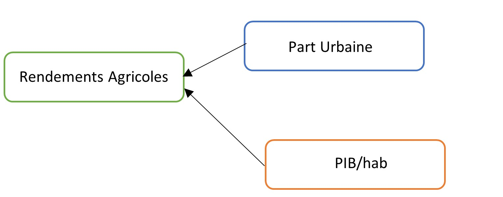

Dernière étape avant les présentations de vos projets. Il me semble important de bien préciser un point de votre cours avant que vous réalisiez l'analyse de vos résultats. Parlons du __biais de variable omise__.

# Le biais de variable omise
Qu'est ce qu'un biais de variable omise ? C'est l'existence d'un biais (positif ou négatif) dans les coefficients estimés qui provient de l'omission d'une variable correlée avec Y et les X. Mais encore ?

Partons d'un exemple ! Tout sera plus clair.

Imaginons, pour la dernière fois du semestre je vous le promet, que l'on veut estimer... la relation entre la part de la population urbaine et les rendements agricoles. La relation bivariée s'écrira :

$rendement\_agricole_i = \beta_0 + \beta_1 \times part\_urbaine_i + \epsilon_i$

Comme vous pourrez facilement le noter, la part de la population urbaine n'est pas le seul facteur qui va influencer les rendements agricoles. Il existe une multitude de facteurs qui affectent les rendements agricoles - c'est à dire qui sont __corrélés avec les rendements agricoles__. Prenons l'exemple du niveau de richesse par habitant d'un pays: le PIB/hab. Si cette variable à un impact sur le niveau de rendements agricoles, alors le vrai modèle s'écrit :

 $rendement\_agricole_i = \tilde{\beta_0} + \tilde{\beta_1} \times part\_urbaine_i + \tilde{\beta_2} \times pib\_hab_i + u_i$. 

En conséquence, l'effet du PIB/hab sur les rendements agricoles était capturé dans le premiere modèle par $\epsilon_i = \tilde{\beta_2} \times pib\_hab_i + u_i$

Rappelons nous que l'une des hypothèses de Gauss-Markov, qui garantie que la relation est causale, est : $cov(\epsilon_i,X_i)=0$

Or, s'il existe une relation entre le PIB/habitant et la part urbaine de la population, alors $cov(\epsilon_i,X_i) \neq 0$. Cela va induire que l'on ne pourra pas isoler l'effet de la part urbaine sur les rendements agricoles, mais que celui-ci capturera également une partie de l'effet du pib/hab qui n'a pas été inclus dans le modèle.

La question que l'on se pose, c'est donc de comprendre l'impact de l'omission du PIB/hab sur le coefficient $\beta_1$ que l'on a estimé.

Deux cas de figure :

1. Admettons tout d'abord qu'il n'existe aucune corrélation entre la part de la population urbaine et le PIB/hab. On vérifie donc bien la relation $cov(\epsilon_i,X_i)=0$. Notre coefficient $\beta_1$ ne sera pas biaisé, mais l'omission de la variable PIB/hab entraînera un plus petit R-carré - c'est à dire que notre modèle sera moins précis pour prédire les variations des rendements agricoles. 
```{r,echo = FALSE, out.width = "100px"}

```

2. Admettons maintenant qu'il existe une corrélation entre le part urbaine de la population et le PIB/hab. Cela veut dire que $cov(\epsilon_i,part\_urbaine_i) \neq 0$, c'est-à-dire que les erreurs sont corrélées avec la part urbaine car $cov(pib\_hab_i,part\_urbaine_i) \neq 0$. Dans ce cas cas de figure on a donc un __biais de variable omise__. On ne peut pas isoler l'effet de la part urbaine sur les rendements agricoles, et $\beta_1$ va être biaisé. Il va soit _surestimer_ la relation réelle entre part urbaine et rendements, soit la _sous-estimer_. En effet, comme on le voit ci-dessous, l'effet du pib/hab va être en partie capturé par la part urbaine via laquelle il transite pour impacter les rendements agricoles. Or, nous aimerions isoler l'effet de la part urbaine. 

```{r,echo = FALSE, out.width = "300px"}
knitr::include_graphics("td8/biasee.jpg")
```

Comment savoir si $\beta_1$ souffre d'un biais positif ou négatif ? La réponse va dépendre du signe de la relation entre la part urbaine et le pib/hab mais également du signe de la relation entre les rendements agricoles et le pib/hab.

* Si $\beta_2$ est positif, c'est-à-dire qu'il existe une relation positive entre pib/hab et rendements agricoles, alors $\beta_1$ sera baisé _positivement_ si la part urbaine et le pib/hab ont une corrélation positive, tandis que $\beta_1$ sera baisé _négativement_ si la part urbaine et le pib/hab ont une corrélation négative.
* Si $\beta_2$ est négatif, c'est-à-dire qu'il existe une relation négative entre pib/hab et rendements agricoles, alors $\beta_1$ sera baisé _négativement_ si la part urbaine et le pib/hab ont une corrélation positive, tandis que $\beta_1$ sera baisé _positivement_ si la part urbaine et le pib/hab ont une corrélation négative.


|                  |      $corr(pib\_hab_i,part\_urbaine_i)>0$        |  $corr(pib\_hab_i,part\_urbaine_i)<0$    | 
|-----------------:|:------------------------------|:----------------------|
| $\beta_2>0$      |            Biais positif      |          Biais négatif|
| $\beta_2<0$      |            Biais négatif     |  Biais positif     |

Le biais de variable omise est donc un outil utile pour choisir les variables de son modèle et aussi pour avoir un regard critique sur celui que l'on a construit.